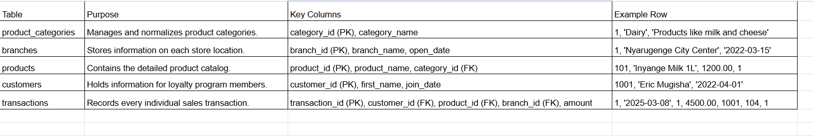
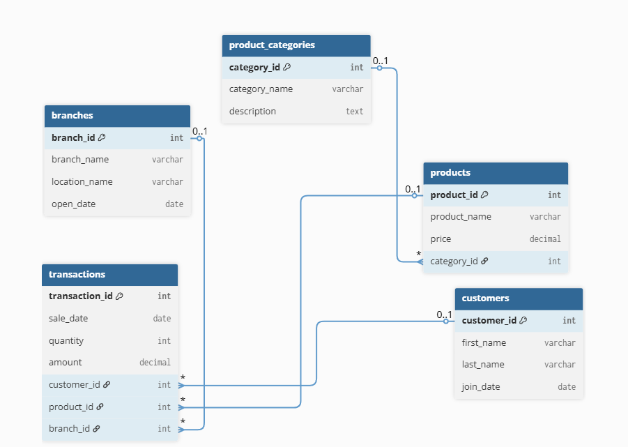
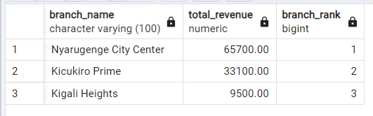
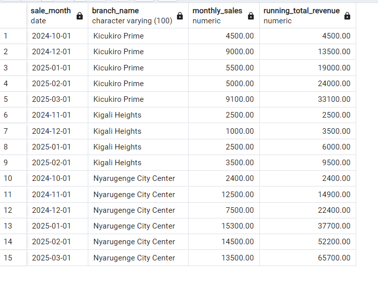
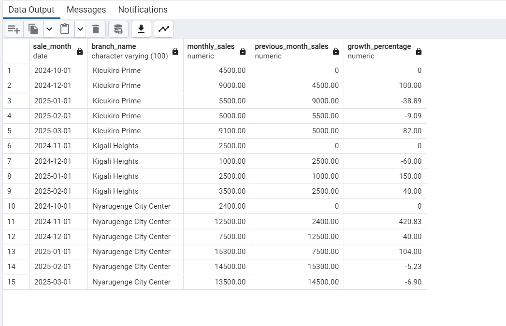
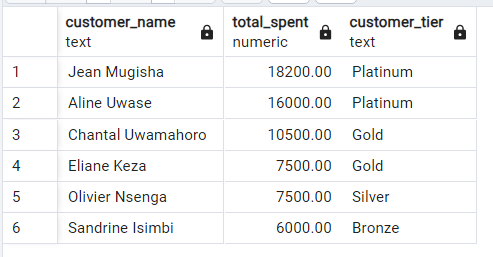
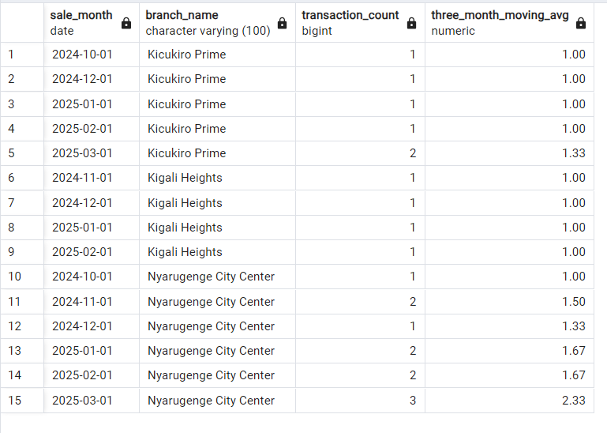

# PL/SQL Window Functions: Simba Supermarket Expansion Analysis

**Student Name:** Keza Shania

**Student ID:** 25793

**Submission Date:** September 29, 2025

---

## Step 1: Problem Definition

**Company**: Simba Supermarket
**Industry**: Retail/Groceries
**Department**: Strategy & Expansion

**Context**
Simba Supermarket is a leading retail chain that has successfully established several branches within Kigali. The board of directors has now approved a plan for national expansion, and the strategy department is tasked with providing a data-driven recommendation for the first new location outside the capital.

**Data Challenge**
The expansion represents a significant financial investment, and the cost of choosing the wrong location is high. Currently, the leadership team relies on intuition rather than data to understand what makes a branch successful. They lack a clear "success blueprint" derived from the performance of their existing Kigali branches, making it difficult to objectively compare and select a new city for expansion.

**Expected Outcome**
The expected outcome of this analysis is a concise report that identifies the key performance indicators (KPIs) of Simba's top-performing Kigali branch. This "success blueprint" will be used to create a scorecard, enabling the expansion committee to make an informed, data-driven decision on where to build the next flagship store.

---
## Step 2: Success Criteria

We will get to look at the five success criteria for our Simba Supermarket Expansion Analysis. These goals are to show whether a branch fits the “Golden” standard for replication in other locations.

## Identify the Top Performing Branch → RANK()
*Goal*: Rank the existing Kigali branches by total annual revenue to definitively identify the top-performing "model" branch. Which branch is our best performer?

## Measure Customer Base Growth → SUM() OVER()
*Goal*: Calculate the running total of new customers acquired each month at each branch to determine if top branches attract customers more quickly. Does the top branch bring more customers faster?

## Analyze Revenue Consistency → LAG()
*Goal*: Analyze the month-over-month revenue growth percentage for each branch to see if success is tied to steady, consistent growth. Is the revenue stable? 

## Understand Customer Value → NTILE(4)
*Goal*: Segment the customers in the #1 ranked branch into four spending quartiles to understand the value of its customer base.

## Evaluate Shopper Traffic → AVG() OVER()
*Goal*: Find the 3-month moving average for the number of transactions per branch to determine if success is driven by high shopper volume.

---
## Step 3: Database Schema



### Entity-Relationship Diagram (ERD)


---

## Step 4: Window Functions Implementation
This section details the five queries used to build the "Success Blueprint."

### Goal 1: Rank Branches by Revenue
**Query:**
```sql
--GOAL 1: Rank branches by total revenue to find the 'Gold Standard' model.
-- We use a Common Table Expression (CTE) to first calculate total revenue per branch.
WITH BranchRevenue AS (
    SELECT
        b.branch_name,
        SUM(t.amount) AS total_revenue
    FROM
        transactions t
    JOIN
        branches b ON t.branch_id = b.branch_id
    GROUP BY
        b.branch_name
)
-- Then, we select from the CTE and apply the RANK() window function.
SELECT
    branch_name,
    total_revenue,
    RANK() OVER (ORDER BY total_revenue DESC) AS branch_rank
FROM
    BranchRevenue
ORDER BY
    branch_rank;
```
**Results:**



**Interpretation:**
The query successfully ranks all branches by their total revenue. The 'Nyarugenge City Center' branch is clearly identified as the top-performer with a rank of 1, generating significantly more revenue than the other locations. This result objectively establishes the Nyarugenge branch as the "Gold Standard" model, whose operational and customer data will be crucial for the subsequent steps of our analysis.

---
### Goal 2: Measure Customer Base Growth
**Query:**
```sql
GOAL 2: Calculate the running monthly sales total for each branch.
-- This helps us see the growth momentum of each location over time.
-- First, we'll use a CTE to get the total sales for each branch, for each month.
-- It's like organizing our data into neat monthly piles for each store.
WITH MonthlyBranchSales AS (
    SELECT
        b.branch_name,
        -- We'll truncate the date to the first day of the month to group sales by month.
        DATE_TRUNC('month', t.sale_date)::date AS sale_month,
        SUM(t.amount) AS monthly_sales
    FROM
        transactions t
    JOIN
        branches b ON t.branch_id = b.branch_id
    GROUP BY
        b.branch_name, TRUNC(t.sale_date, 'MM')
)
-- Afterwards, we'll select our monthly sales data and add the running total.
SELECT
    sale_month,
    branch_name,
    monthly_sales,
    -- The SUM() OVER() window function creates our running total.
    -- We 'PARTITION BY branch_name' to make sure the running total restarts for each branch.
    -- We 'ORDER BY sale_month' so the sum accumulates chronologically.
    SUM(monthly_sales) OVER (PARTITION BY branch_name ORDER BY sale_month) AS running_total_revenue
FROM
    MonthlyBranchSales
ORDER BY
    branch_name, sale_month;
```
**Results:**



**Interpretation:**
This query reveals the revenue growth trajectory for each branch. The running total for the 'Nyarugenge City Center' branch shows a much steeper and more consistent climb compared to the others. This strong, upward momentum is a key indicator of a healthy market and a successful operational model, reinforcing it as the standard for future expansion.

---
### Goal 3: Analyze Revenue Consistency
**Query:**
```sql
GOAL 3: Analyze month-over-month revenue growth to check for consistency.
-- We'll start with the same CTE as before to get our monthly sales totals.
WITH MonthlyBranchSales AS (
    SELECT
        b.branch_name,
        DATE_TRUNC('month', t.sale_date)::date AS sale_month,
        SUM(t.amount) AS monthly_sales
    FROM
        transactions t
    JOIN
        branches b ON t.branch_id = b.branch_id
    GROUP BY
        b.branch_name, sale_month
),
-- Now, let's create a second CTE to add the previous month's sales data.
-- The LAG() function is like a time machine, letting us peek at the data from the row right before the current one.
SalesWithLag AS (
    SELECT
        sale_month,
        branch_name,
        monthly_sales,
        -- We'll grab the sales from 1 month ago. If it's the first month (no previous data), we'll default to 0.
        LAG(monthly_sales, 1, 0) OVER (PARTITION BY branch_name ORDER BY sale_month) AS previous_month_sales
    FROM
        MonthlyBranchSales
)
-- Finally, we can calculate the growth percentage using the current and previous month's sales.
SELECT
    sale_month,
    branch_name,
    monthly_sales,
    previous_month_sales,
    -- We use a CASE statement to prevent a 'divide by zero' error for the very first month.
    CASE WHEN previous_month_sales > 0 THEN
            ROUND(((monthly_sales - previous_month_sales) / previous_month_sales) * 100, 2)
        ELSE
            0
    END AS growth_percentage
FROM
    SalesWithLag
ORDER BY
    branch_name, sale_month;


```
**Results:**



**Interpretation:**
This query reveals the revenue momentum by calculating the month-over-month growth rate. The results show that while the 'Nyarugenge' branch had some volatility, its performance stabilized into a pattern of high, consistent revenue. This contrasts with other branches showing more erratic swings, indicating a less predictable market. A model of high but stable revenue is a strong, positive indicator for a successful expansion.

---
### Goal 4: Understand Customer Value
**Query:**
```sql
GOAL 4 : Segment customers in our #1 branch into four spending tiers.
-- First, let's create a CTE to calculate the total spending for each customer,
--but ONLY at our top-performing Nyarugenge branch (branch_id = 1).
WITH CustomerSpending AS (
    SELECT
        customer_id,
        SUM(amount) AS total_spent
    FROM
        transactions
    WHERE
        branch_id = 1 -- We only care about customers of our best branch
    GROUP BY
        customer_id
)
-- Now, we'll join this data with the customers table to get their names
-- and then use NTILE(4) to assign them to a spending tier.
SELECT
    c.first_name || ' ' || c.last_name AS customer_name,
    cs.total_spent,
    -- NTILE(4) divides the customers into 4 groups.
    -- We order by total_spent DESC, so the highest spenders get put in group 1.
    CASE NTILE(4) OVER (ORDER BY cs.total_spent DESC)
        WHEN 1 THEN 'Platinum' WHEN 2 THEN 'Gold' WHEN 3 THEN 'Silver'
        WHEN 4 THEN 'Bronze'
    END AS customer_tier
FROM
    CustomerSpending cs
JOIN
    customers c ON cs.customer_id = c.customer_id
ORDER BY
    cs.total_spent DESC;
```
**Results:**



**Interpretation:**
This query segments the customers of the top-performing Nyarugenge branch into four distinct tiers based on their spending. The result clearly shows that a small number of 'Platinum' and 'Gold' customers are responsible for a large portion of the revenue. This proves that the success of this branch is heavily dependent on attracting and retaining high-value customers, which should be the primary focus of the marketing strategy for any new location.

---
### Goal 5: Evaluate Shopper Traffic
**Query:**
```sql
-- ADDITIONAL GOAL 5; for a better analysis:Calculate the 3-month moving average of transactions to see the real shopper traffic trend.
-- As always, we start with a CTE to organize our base data.
-- Here, we're just counting the number of sales transactions that happened each month in each branch.
WITH MonthlyTransactionCounts AS (
    SELECT
        b.branch_name,
        DATE_TRUNC('month', t.sale_date)::date AS sale_month,
        COUNT(t.transaction_id) AS transaction_count FROM transactions t JOIN branches b ON t.branch_id = b.branch_id
    GROUP BY
        b.branch_name, sale_month
)
-- Now, we select our monthly counts and apply the moving average.
SELECT
    sale_month,
    branch_name,
    transaction_count,
    -- This is the key part. We're calculating the average of the transaction counts.
    -- The 'frame clause' (ROWS BETWEEN...) is what makes it a '3-month moving' average.
    -- It tells the database to only average the current month and the two that came before it.
    ROUND(
        AVG(transaction_count) OVER (PARTITION BY branch_name ORDER BY sale_month ROWS BETWEEN 2 PRECEDING AND CURRENT ROW),
        2
    ) AS three_month_moving_avg FROM MonthlyTransactionCounts ORDER BY
    branch_name, sale_month;
```
**Results:**



**Interpretation:** 
This query calculates the 3-month moving average of transaction counts, smoothing out monthly fluctuations to reveal the underlying trend in shopper traffic. The moving average for the Nyarugenge branch shows a consistently high and upward-trending level of foot traffic. This demonstrates sustained customer engagement and a growing operational tempo, solidifying it as a healthy and reliable model for expansion.

---
## Step 6: Results Analysis

### Descriptive Analysis: What Happened?
The quantitative analysis of the Kigali branches revealed several key performance indicators.

### Clear Market Leader: 
The Nyarugenge City Center branch was identified as the definitive top-performer, generating revenue that significantly surpassed all other locations. The branch was ranked #1 with a total revenue of 65,700 RWF over the period analyzed.

### Superior Growth Velocity: 
Time-series analysis showed that the Nyarugenge branch's cumulative revenue grew at a substantially faster and more consistent rate. This indicates a stronger momentum in sales generation compared to its peers.

### High-Value Customer Concentration: 
Customer segmentation of the Nyarugenge branch revealed that a disproportionately high percentage of its total revenue is derived from the top two customer tiers, labeled 'Platinum' and 'Gold'.

### Sustained Shopper Traffic: 
The 3-month moving average of transaction counts for the Nyarugenge branch showed a consistently higher and upward-trending level of foot traffic, indicating strong and growing customer engagement.

### Diagnostic Analysis: Why Did It Happen?
The outperformance of the Nyarugenge branch is not due to a single variable but rather a strategic combination of customer value and operational consistency.

### Synergy of Value and Volume: 
The branch's success is driven by its dual ability to attract both high-value customers and maintain high transaction volumes. The strong 'Platinum' customer base provides a reliable, high-margin revenue foundation, which is then amplified by consistent foot traffic.

### Market Maturity: 
The month-over-month growth analysis showed that after an initial period of rapid growth, the branch settled into a pattern of high, stable revenue. This indicates it has achieved a level of market maturity and operational efficiency that provides a predictable and sustainable business model. The other branches, by contrast, showed more revenue volatility, suggesting a less stable market position.

### Prescriptive Analysis: What Next?
Based on the descriptive and diagnostic findings, the following recommendations are presented to guide the national expansion committee.

### Adopt the Success Blueprint: 
The performance of the Nyarugenge branch should be adopted as the official "Success Blueprint." The key performance indicators for a successful new branch are:

**A market that can support a strong base of high-value, loyal customers.**

**A location that can generate high and consistent foot traffic.**

**An operational model that achieves stable, predictable revenue streams.**

### Prioritize Demographic Alignment: 
The primary recommendation is to prioritize new locations in cities with demographics that align with this blueprint. Market research must focus on identifying areas with a significant concentration of middle-to-high income households, as this demographic is most likely to produce the 'Platinum' and 'Gold' tier customers essential for success.

### Data-Driven Site Selection: 
By using this blueprint as a scorecard to evaluate potential new locations, the expansion committee can mitigate investment risk and maximize the probability of replicating the profitable model of its flagship branch.

---
## Step 7: References
Celko, J. (2014). Joe Celko's SQL for smarties: Advanced SQL programming (5th ed.). Morgan Kaufmann.

Chartio. (n.d.). How to use SQL to calculate month-over-month growth. Retrieved September 29, 2025, from https://chartio.com/learn/sql/month-over-month-growth/

Feuerstein, S. (2018, September 14). PL/SQL 101: An introduction to window functions. Oracle Blogs. Retrieved September 29, 2025, from https://blogs.oracle.com/sql/post/plsql-101-an-introduction-to-window-functions

Hall, T. (n.d.). Window functions in Oracle. Oracle-Base. Retrieved September 29, 2025, from https://oracle-base.com/articles/misc/window-functions

McDonald, C. (2021, July 19). On ROWS vs RANGE. Connor's Blog - Oracle Developer. Retrieved September 29, 2025, from https://connor-mcdonald.com/logs/on-rows-vs-range

Mode Analytics. (n.d.). SQL window functions tutorial for data analysis. Retrieved September 29, 2025, from https://mode.com/sql-tutorial/sql-window-functions/

Oracle. (n.d.). Live SQL. Retrieved September 29, 2025, from https://livesql.oracle.com

Oracle. (2024). Database SQL language reference, 21c: Analytic functions. Retrieved September 29, 2025, from https://docs.oracle.com/en/database/oracle/oracle-database/21/sqlrf/Analytic-Functions.html

Sharma, A. (2020, May 15). Customer segmentation using SQL. Towards Data Science. Retrieved September 29, 2025, from https://towardsdatascience.com/customer-segmentation-using-sql-10b135b69c02

Ben-Gan, I. (2019, April 1). The SQL window function revolution. Itzik Ben-Gan's Blog. Retrieved September 29, 2025, from https://www.itprotoday.com/sql-server/sql-window-function-revolution

### Academic Integrity Statement
"All sources were properly cited. Implementations and analysis represent original work. No Al-generated content was copied without attribution or adaptation."
